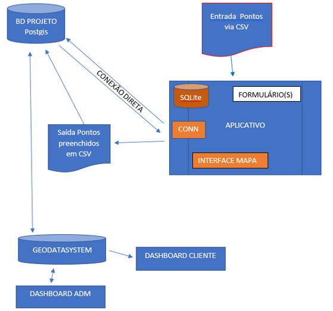

# GDataSystems

<h2>Sistema de aquisição de dados de campo em exploração mineral</h2>

 O GDataSystems é um sistema para o registro de dados de campo em exploração mineral focado no maomento em:

<li> Amostragem de Solo
<li> Amostragem de Sedimento de Corrente

 Em breve será incluído:

<li> Mapeamento Geológico e coleta de amostras de rocha
<li> Resultados geoquímicos
<li> Acompanhamento de Sondagem
<li> Descrição de Sondagem

O sistema utiliza plugins personalizados do QGIS, aplicativos Android e interface web de onde podemos adquirir dados e acessar as ferramentas principais de visualização e exportação dos dados de exploração.

Alternativamente o sistema pode funcionar com arquivos ao invés de Banco de dados.

<h1>Instalação</h1>
<h2>Criando o Banco de Dados Postgis</h2>

Caso decida usar o banco de dados (<b>recomendado</b>), em um servidor com postgres e postgis cria o seguinte banco de dados usando:

<pre>
createdb nomeBanco --encoding=utf-8
psql nomeBanco -c "CREATE EXTENSION postgis"
</pre>

Onde noBanco é o nome do banco de dados escolhido.

Altere no arquivo os valores de usuariosolo e usuariosed e também senhaSecreta de acordo com os usuário que usarão o sistema e em seguida e execute: <pre> <b>psql -d nomeBanco -f criaTabelas.sql</b></pre>
 Não altere os nomes das tablelas e nem dos campos nesse arquivo, somente usuários e senhas. 

 Os campos de acesso a serem usados pelos plugins QGIS e Aplicativos android serão:

<li> SERVIDOR - IP ou nome de domínio do servidor com o banco de dados
<li> USUÁRIO - nome do usuário 
<li> SENHA - senha definida para o usuário
<li> NOMEdoBANCO - Nome do baco de dados criado
<lI> SRID - Número do sistema de coordanada usado
<h2>Instalando Plugins do QGIS</h2>

Para instalar o Plugin siga as intruções abaixo de acordo com o sistema operacional rodando o QGIS.

<h4>Windows</h4>

<h4>Lunux</h4>

<h4>OSX</h4>

<h2>Baixando os aplicativos</h2>

Os aplicativos SoloTabOSM e SedcorTabOSM estão disponíveis na Google Play Store.

<h2>Mairoes informações</h2>

Informações mais detalhadas do sistema podem ser enconradas na pasta manual.

